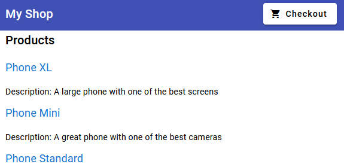
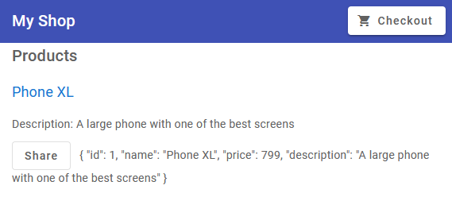

## swith to a new empty branch

```javascript
git switch --orphan <new branch>
git commit --allow-empty -m "Initial commit on orphan branch"
git push -u origin <new branch>
```

```javascript
New-Item README.md
mkdir front-shop
cd front-shop
ng new front-shop --directory ./
ng add @angular/material
```

```javascript
npm run start

```

### init w mat


```javascript
mkdir views
ng g c  views/top-bar --dry-run

ng g c views/product-list --dry-run
```


### add routing

```javascript
ng generate module app-routing --flat --module=app
```

### structural directives



### pass data to a child component

```javascript
ng generate component views/product-alerts --dry-run

```

`src/app/product-alerts/product-alerts.component.ts`

```javascript
  @Input() product!: IPoduct;

```


