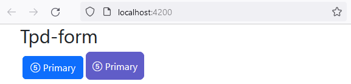
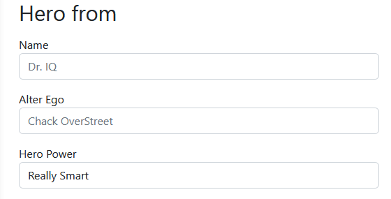
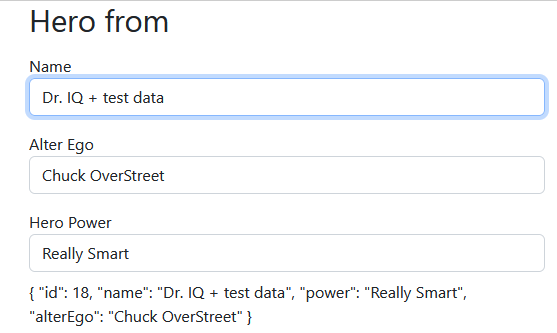
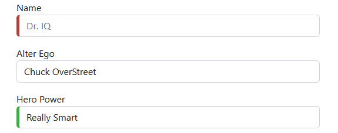
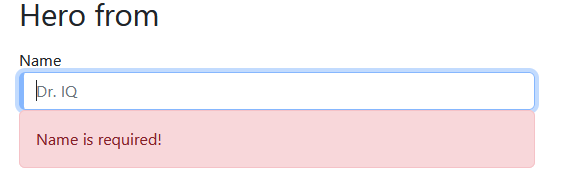
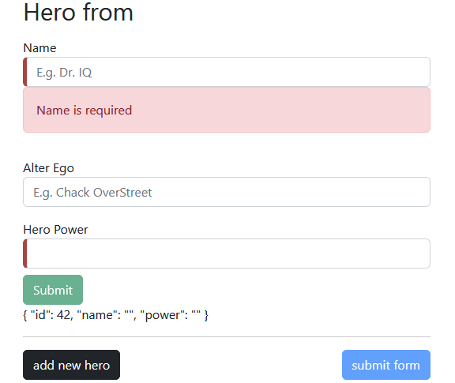

## swith to a new empty branch

```javascript
git switch --orphan tpd-form
git commit --allow-empty -m "init commit"
git push -u origin tpd-form
```

- init ang app

```javascript
New-Item README.md
New-Item .gitignore
mkdir tpd-form
cd tpd-form
ng new tpd-form --directory ./
```

- add bootstrap w custom CSS properties(--var)

```javascript
npm i bootstrap
npm i bootstrap-icons

```

`style.scss`

```javascript
@import "~bootstrap/dist/css/bootstrap.min.css";
@import "~bootstrap-icons/font/bootstrap-icons.css";

* {
  margin: 0;
  padding: 0;
}

:root {
  --primary-color: #605dc8;
  --secondary-color: #8b89e6;
  --accent-color: #e8e7fa;
  --shadow-color: #e8e8e8;
}

button.primary {
  padding: 10px;
  border: solid 1px var(--primary-color);
  background: var(--primary-color);
  color: white;
  border-radius: 8px;
}

```



### add comp & data model class

```javascript
ng g c views/hero-form --inline-style --inline-template --skip-tests --dry-run
```



### bind input controls to data properties



### add css form validation



- display alert msg

```javascript
      <input  #name="ngModel"/>
      <div [hidden]="name.valid || name.pristine" class="alert alert-danger">
        Name is required
      </div>
```



### submit the form with/without ngSubmit


