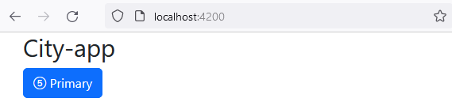
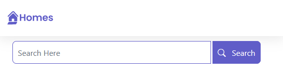
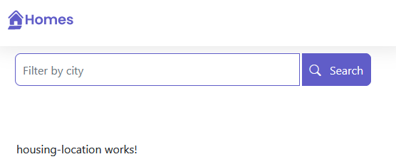
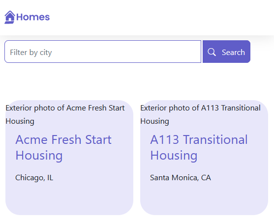
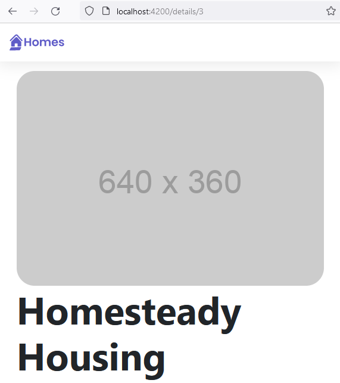
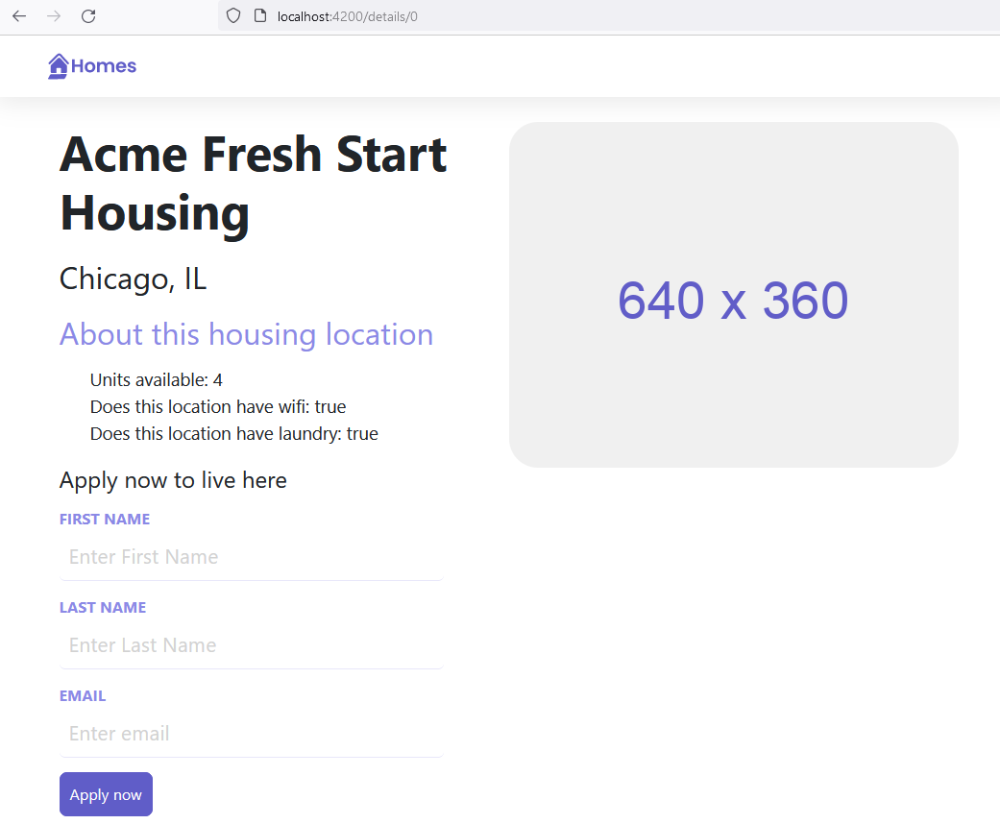
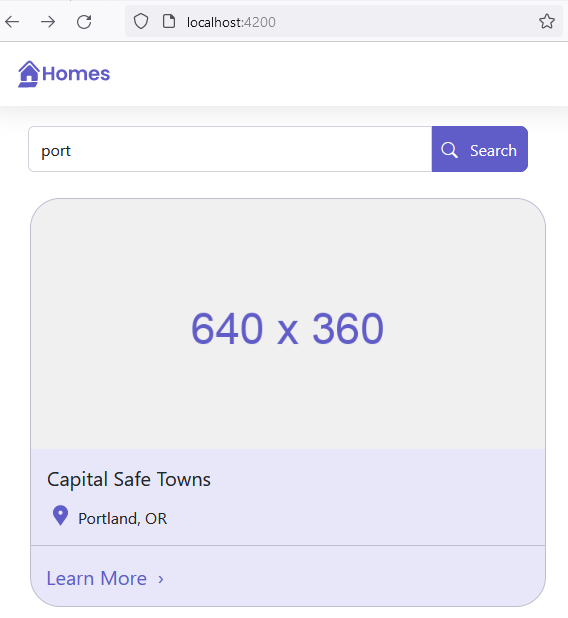
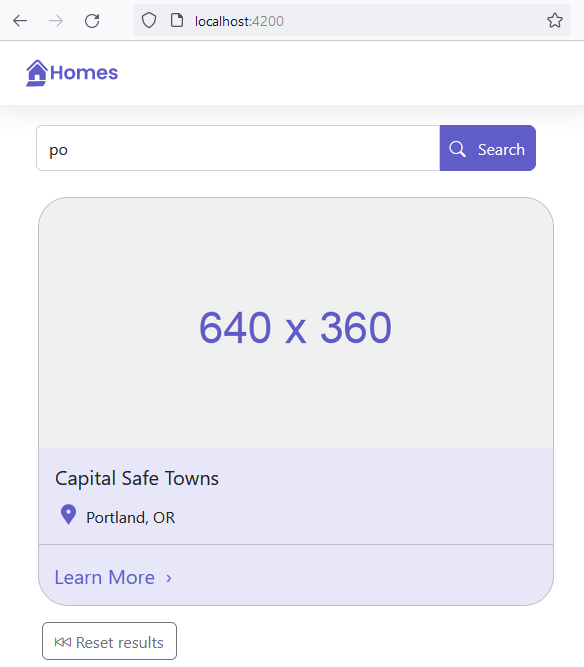
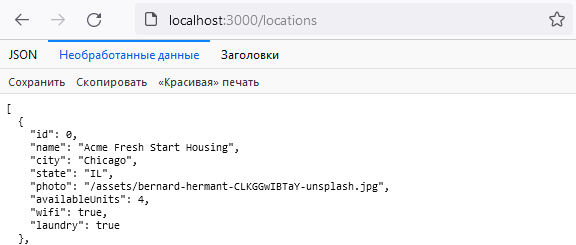

## swith to a new empty branch

```javascript
git switch --orphan <new branch>
git commit --allow-empty -m "Initial commit on orphan branch"
git push -u origin <new branch>
```

```javascript
New-Item README.md
New-Item .gitignore
mkdir city-app
cd city-app
ng new front-shop --directory ./
```

## add bootstrap

```javascript
npm i bootstrap
npm i bootstrap-icons

```

`styles.scss`

```javascript
@import "~bootstrap/dist/css/bootstrap.min.css";
@import "~bootstrap-icons/font/bootstrap-icons.css";

```

### init with bootstrap



### add home comp w css

```javascript
ng g c views/home --inline-template --skip-tests --dry-run

```



### add housing-location comp w css

```javascript
ng g c views/housingLocation --inline-template --skip-tests --dry-run
```

### add models

```javascript
ng g i models/housinglocation  --dry-run
```



### send data from parent

```javascript
<app-housing-location
    *ngFor="let housingLocationsss of housingLocationList"
    [housingLocation]="housingLocationsss"
></app-housing-location>
```



### add service

```javascript
ng g s services/housing --skip-tests --dry-run
```

### add comp

```javascript
ng g c views/details --inline-style --inline-template --skip-tests --dry-run
```

### add routing

```javascript
ng generate module app-routing --flat --module=app --dry-run
```

- use route paramter to retrieve data



### add a form using Angular's forms feature

- connect the data captured in the form to a form using an event handler

`housing.service.ts`

```javascript
  submitAplication(firstName: string, lastName: string, email: string) {
    console.log(
      `Homes application recieved: firstName: ${firstName}, lastName: ${lastName}, email: ${email}`
    );
  }
```

`detais.component.ts`

```javascript
export class DetailsComponent {
  applyForm = new FormGroup({
    firstName: new FormControl(""),
    lastName: new FormControl(""),
    email: new FormControl(""),
  });

  submitApplication() {
    this.housingService.submitAplication(
      this.applyForm.value.firstName ?? "",
      this.applyForm.value.lastName ?? "",
      this.applyForm.value.email ?? ""
    );
  }
}
```



### add search feature

- filter data

`housing.service.ts`

```javascript
  getFilteredLocationList(text: string): Observable<IHousingLocation[]> {
    return of(
      this.housingLocationList.filter((housingLocation) =>
        housingLocation.city.toLowerCase().includes(text.toLowerCase())
      )
    );
  }
```

`home.component.ts`

- click handle, pass data, get data

```javascript
  filterResults(text: string) {
    this.housingService
      .getFilteredLocationList(text)
      .subscribe(
        (filteredLocation) => (this.housingLocationList = filteredLocation)
      );
  }
```



### add reset search results



### ad json-server, refactor service to use web server instead of local array

```javascripts
npm install -g json-server

// PS D:\work\ang-test\city-app> json-server --watch ./server/db.json

```



`app.modules.ts`

- add HttpClient provided by Angular

```javascript
import { HttpClientModule } from '@angular/common/http';

@NgModule({
  imports: [ HttpClientModule],
})
```

`housing.services.ts`

- change func with Observale

`details.component.ts & home.components.ts`

- subscribe to related func

# The End
