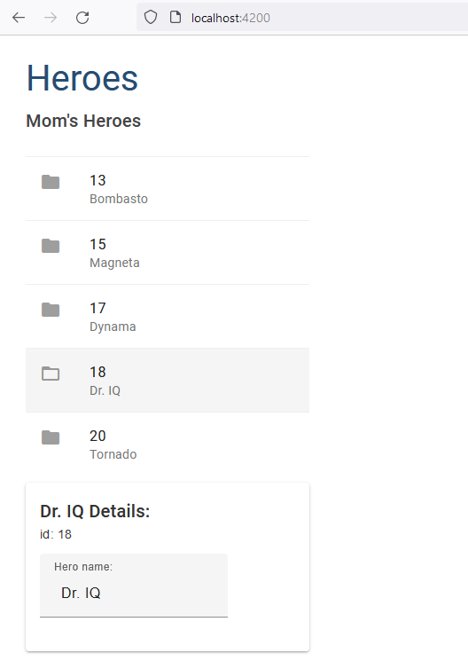
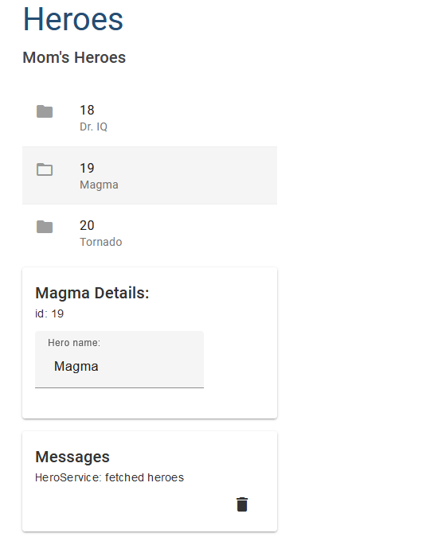
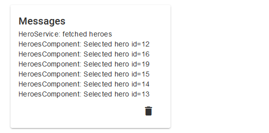
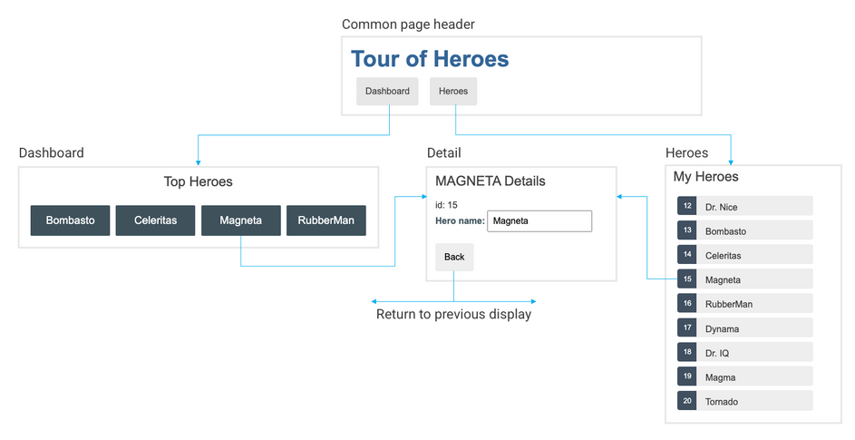
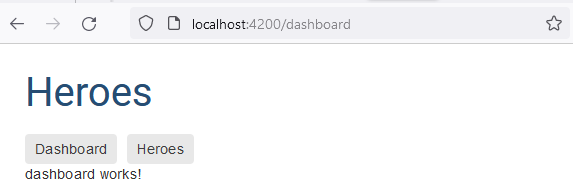

## swith to a new empty branch

```javascript
git switch --orphan heroes
git commit --allow-empty -m "Initial commit on orphan branch"
git push -u origin heroes
```

```javascript
New-Item README.md
New-Item .gitignore
mkdir heroes
cd heroes
ng new heroes --directory ./
```


### add css(scss)


### add component, Angular Material, 2 way binding

```javascript
ng g c views/heroes --skip-tests --dry-run

ng add @angular/material
```


### add mock, display data list, select data, conditionally HTML, toggle CSS with class binding



### create a feature component (split a large comp)

```javascript
ng g c views/hero-detail --dry-run
```

- send data from parent to child with Angular property binding (@Input)

```javascript
<app-hero-detail [hero]="selectedHero"></app-hero-detail>

import { Input } from '@angular/core';

export class HeroDetailComponent {
  @Input() hero?: Hero;
}
```

### add services, implements service for a component

```javascript
ng g s services/hero --dry-run

import { IHero } from 'src/app/models/hero';
import { HeroService } from 'src/app/services/hero.service';

export class HeroesComponent implements OnInit {
  heroes: IHero[] = [];

  constructor(private heroService: HeroService) {}

  ngOnInit(): void {
    this.getHeroes();
  }

  getHeroes() {
    this.heroes = this.heroService.getHeroes();
  }
}

```

### add Observable (asynchronous approach with [RxJS library](https://rxjs.dev/))

```javascript
getHeroes(): Observable<Hero[]> {
  const heroes = of(HEROES);
  return heroes;
}

```

### show message with service

```javascript
ng g c views/messages --skip-tests --dry-run
ng g s services/message --dry-run

// service exposes its cache of messages and two methods:
export class MessageService {
  messages: string[] = [];

  add(message: string) {
    this.messages.push(message);
  }

  clear() {
    this.messages = [];
  }
}
```

- import MessageService to HeroService
<!-- This is an example of a typical service-in-service scenario in which we inject the MessageService into the HeroService which is injected into the HeroesComponent. -->

```javascript
getHeroes(): Observable<Hero[]> {
  const heroes = of(HEROES);
  this.messageService.add('HeroService: fetched heroes');
  return heroes;
}

  // messages.component.ts
export class MessagesComponent {
  /* The messageService property must be public because we're going to bind to it in the template.
  Angular only binds to public component properties.
  */
 constructor(public messageService: MessageService) {}
}

 // messages.component.html
<div *ngIf="messageService.messages.length">
  <h2>Messages</h2>
  <button type="button" class="clear"
          (click)="messageService.clear()">Clear messages</button>
  <div *ngFor='let message of messageService.messages'> {{message}} </div>
</div>
```



### add msg srv to another comp

```javascript
import { MessageService } from 'src/app/services/message.service';

export class HeroesComponent implements OnInit {
  heroes: IHero[] = [];
  selectedHero?: IHero;

  constructor(
    private messageService: MessageService
  ) {}

  onSelect(hero: IHero) {
    this.selectedHero = hero;
    this.messageService.add(`HeroesComponent: Selected hero id=${hero.id}`);
  }
}
```



### app nav structure



```javascript
ng generate module app-routing --flat --module=app --dry-run

// basic routing
import { NgModule } from '@angular/core';
import { RouterModule, Routes } from '@angular/router';
import { HeroesComponent } from './views/heroes/heroes.component';

const routes: Routes = [{ path: 'heroes', component: HeroesComponent }];

@NgModule({
  imports: [RouterModule.forRoot(routes)],
  exports: [RouterModule],
})
export class AppRoutingModule {}
```


### add dashboard comp w inline opt

```javascript
ng g c views/dashboard --inline-style --inline-template --skip-tests --dry-run

// router to navigate among different components
const routes: Routes = [
  { path: '', redirectTo: 'dashboard', pathMatch: 'full' },
  { path: 'dashboard', component: DashboardComponent },
  { path: 'heroes', component: HeroesComponent },
  { path: '**', redirectTo: 'dashboard' },
];

```


