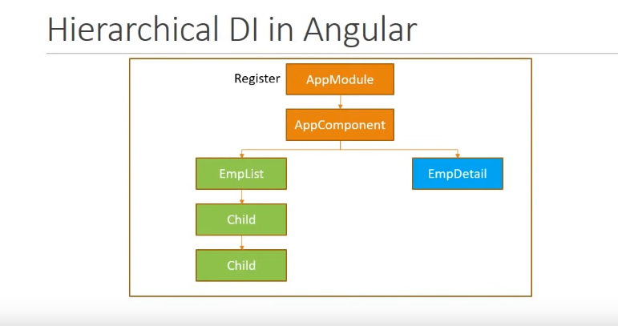
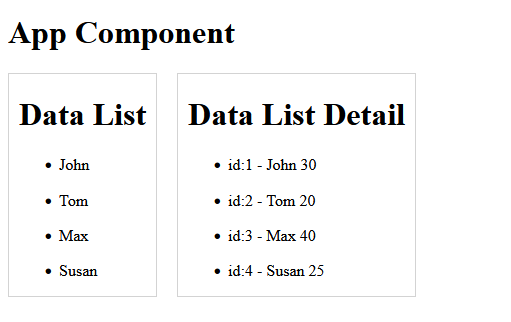

# BaseRouting

This project was generated with [Angular CLI](https://github.com/angular/angular-cli) version 15.2.2.

## Development server

Run `ng serve` for a dev server. Navigate to `http://localhost:4200/`. The application will automatically reload if you change any of the source files.

## Code scaffolding

Run `ng generate component component-name` to generate a new component. You can also use `ng generate directive|pipe|service|class|guard|interface|enum|module`.

## Build

Run `ng build` to build the project. The build artifacts will be stored in the `dist/` directory.

## Running unit tests

Run `ng test` to execute the unit tests via [Karma](https://karma-runner.github.io).

## Running end-to-end tests

Run `ng e2e` to execute the end-to-end tests via a platform of your choice. To use this command, you need to first add a package that implements end-to-end testing capabilities.

## Further help

To get more help on the Angular CLI use `ng help` or go check out the [Angular CLI Overview and Command Reference](https://angular.io/cli) page.

---

## Service & DI


- step 1 (create service)
  
- step 2 (register service as ingector)
  

### DI hierarchy

- <ins>component level registry</ins>

  

- <ins>app component level registry</ins>

  

- <ins>module level registry</ins>

  

`app.module.ts`

```javascript
import { EmployeeService } from "./employee.service";

//
// bla-bla-bla
//

providers: [EmployeeService];
```

`employee.component.ts` && `employee-detail.component.ts`

```javascript
import { EmployeeService } from '../employee.service';
import { iEmployee } from './modules/employee';
//
// bla-bla-bla
//

export class EmployeeComponent {
  title = 'data list';
  employeeList!: iEmployee[];

  constructor(private _employeeService: EmployeeService) {}

  ngOnInit() {
    this.employeeList = this._employeeService.getEmployees();
  }
}
```

### di service fin


