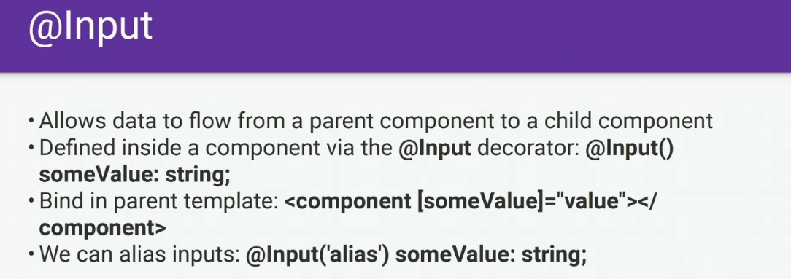

# Front

This project was generated with [Angular CLI](https://github.com/angular/angular-cli) version 15.2.2.

## Development server

Run `ng serve` for a dev server. Navigate to `http://localhost:4200/`. The application will automatically reload if you change any of the source files.

## Code scaffolding

Run `ng generate component component-name` to generate a new component. You can also use `ng generate directive|pipe|service|class|guard|interface|enum|module`.

## Build

Run `ng build` to build the project. The build artifacts will be stored in the `dist/` directory.

## Running unit tests

Run `ng test` to execute the unit tests via [Karma](https://karma-runner.github.io).

## Running end-to-end tests

Run `ng e2e` to execute the end-to-end tests via a platform of your choice. To use this command, you need to first add a package that implements end-to-end testing capabilities.

## Further help

## To get more help on the Angular CLI use `ng help` or go check out the [Angular CLI Overview and Command Reference](https://angular.io/cli) page.

# front

```javascript
git switch --orphan <new branch>
git commit --allow-empty -m "Initial commit on orphan branch"
git push -u origin <new branch>

ng new front
cd front
npm i bootstrap
npm i bootstrap-icons

ng g c components/navigation
ng g s services/menu

// add lasy components (init with route and all the flowers)
ng g m components/pages/main --route main --module app.module --dry-run
ng g m components/pages/users --route users --module app.module --dry-run


// add icon module & componet
ng g m components/icon --dry-run
 ng g c components/icon -t -s --skip-tests --dry-run
```

---

## binding in pictures




