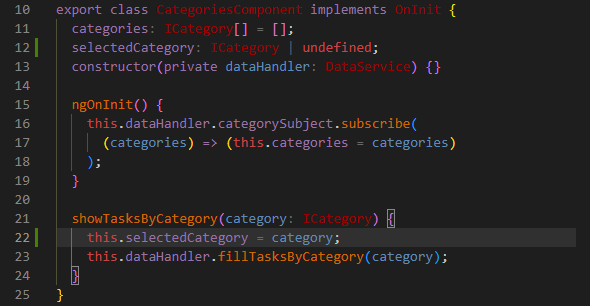

# Spa

This project was generated with [Angular CLI](https://github.com/angular/angular-cli) version 15.2.2.

## Development server

Run `ng serve` for a dev server. Navigate to `http://localhost:4200/`. The application will automatically reload if you change any of the source files.

## Code scaffolding

Run `ng generate component component-name` to generate a new component. You can also use `ng generate directive|pipe|service|class|guard|interface|enum|module`.

## Build

Run `ng build` to build the project. The build artifacts will be stored in the `dist/` directory.

## Running unit tests

Run `ng test` to execute the unit tests via [Karma](https://karma-runner.github.io).

## Running end-to-end tests

Run `ng e2e` to execute the end-to-end tests via a platform of your choice. To use this command, you need to first add a package that implements end-to-end testing capabilities.

## Further help

To get more help on the Angular CLI use `ng help` or go check out the [Angular CLI Overview and Command Reference](https://angular.io/cli) page.

---

## pass data from service to component

- внедрение зависимости - Dependency Injection - получение ссылки на экземпляр класса в любом месте приложения.
- CategoryComponent получает доступ к DataService

[commit→](https://github.com/viktishchenko/ang-test/commit/b1102b7ec4896c39d698aa6a326eaf4f9ab89797)

## event binding e.g (filer by category)

[commit→](https://github.com/viktishchenko/ang-test/commit/9ba75ee27ebba4befaf633f51babed2789d6389c)

## RxJs wrappers

[commit→](https://github.com/viktishchenko/ang-test/commit/7cdd9621715110ea418ec9754806c0953d6ff233)

`wrapper init`
[commit →](https://github.com/viktishchenko/ang-test/commit/6aef30ea96006b6fb5adf8aba68eab96e6fc206e)

`add subscriber`

## Pipe

[`pipe e.g. →`](https://angular.io/api/common/DatePipe)

## add active class

[commit →](https://github.com/viktishchenko/ang-test/commit/2cfb35166cfd2d52cba6ccba5fb1d0536e0e99c2)

## rehearsal

## task status

[commit →](https://github.com/viktishchenko/ang-test/commit/80d43a7bb234be8a92a00ae133db3d0c024f2e31)

## add A-material modules

